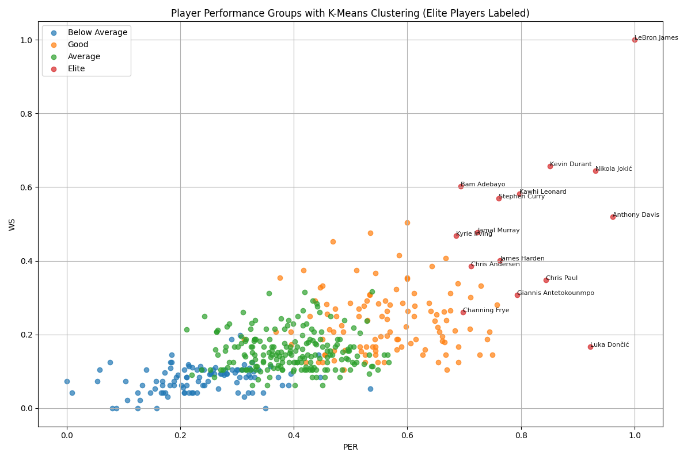

# 🏀 NBA Playoff Player Performance Analysis (2010–2020)

## 🎯 Objective

This project aims to identify the **Top 10 NBA Playoff performers** from 2010 to 2020 using advanced basketball metrics and **K-Means Clustering**. The approach is completely **data-driven**, leveraging machine learning techniques to classify and rank players based on their efficiency and impact.

---

## 📂 Data Source

- All data manually sourced from [Basketball-Reference.com](https://www.basketball-reference.com/)
- Downloaded **Advanced Stats** tables for each playoff season between **2010 and 2020**
- Combined into a single dataset

---

## 🧹 Data Preprocessing

- Concatenated yearly CSV files into a single DataFrame
- Removed duplicate headers, asterisks, and irrelevant characters
- Filtered players with **at least 100 total minutes** per playoff season
- Selected Metrics:
  - **PER** (Player Efficiency Rating)
  - **WS** (Win Shares)
  - **BPM** (Box Plus/Minus)
  - **TS%** (True Shooting Percentage)

---

## 🧠 Feature Engineering & Scoring

- Normalized metrics using **MinMaxScaler**
- Created a composite `Score`:
  
```math
\text{Score} = \frac{\text{PER}_{norm} + \text{WS}_{norm} + \text{BPM}_{norm} + \text{TS\%}_{norm}}{4}
```

---

## 🏆 Top 10 Playoff Performers (2010–2020)

| Rank | Player            | Score   |
|------|-------------------|---------|
| 1    | LeBron James 🥇  | 0.8887  |
| 2    | Nikola Jokić 🥈  | 0.7794  |
| 3    | Kevin Durant 🥉  | 0.7325  |
| 4    | Anthony Davis     | 0.7293  |
| 5    | Kawhi Leonard     | 0.7112  |
| 6    | Stephen Curry     | 0.6781  |
| 7    | Channing Frye     | 0.6745  |
| 8    | Chris Paul        | 0.6525  |
| 9    | Bam Adebayo       | 0.6445  |
| 10   | Chris Andersen    | 0.6438  |

> These scores reflect **overall decade-long playoff performance**, not single-season metrics.

---

## 🤖 Clustering Analysis

- Applied **K-Means (k=4)** clustering on normalized metrics
- Player performance groups:
  - **Elite**
  - **Good**
  - **Average**
  - **Below Average**
- All Top 10 players were clustered as **Elite**

---

## 📈 Visualization

> PER vs WS Scatter Plot with Clustering Labels:



- Clusters are color-coded
- Only **Elite players** are annotated for clarity

---

## 🛠 Tools & Libraries

- Python 3.x
- `pandas`, `numpy`
- `scikit-learn` for normalization and clustering
- `matplotlib` for visualization
- Data source: Manually collected CSV files from Basketball-Reference